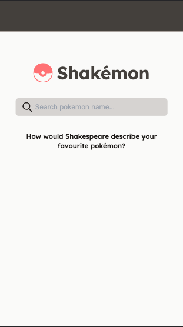
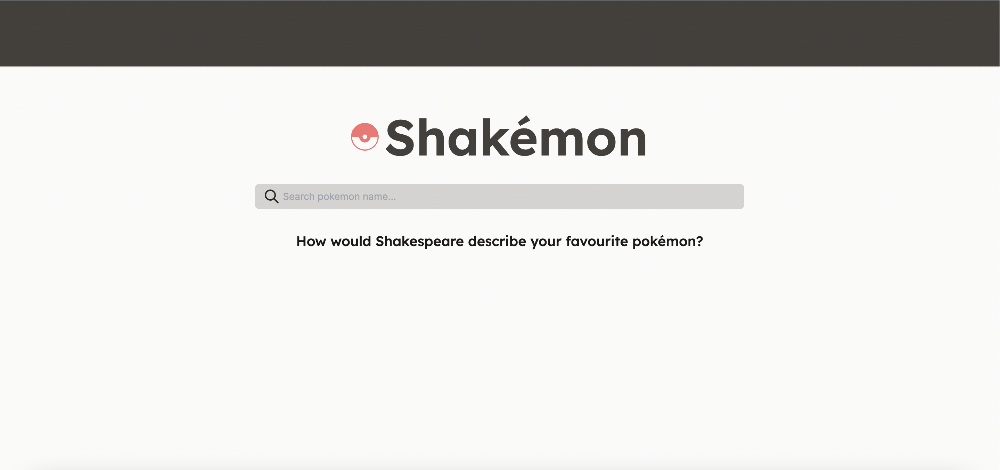
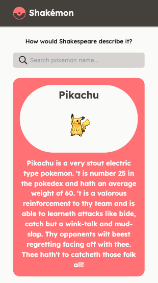
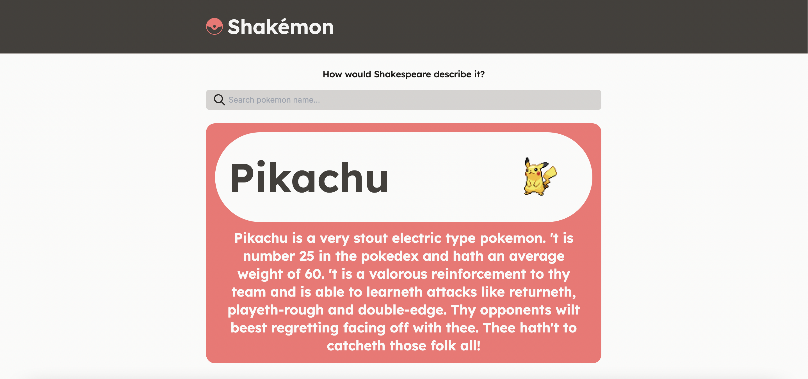

# Shakémon:
## *If Shakespeare wrote the Pokédex*

## Content

1. [Description](#Motivation) 
2. [Requirements](#Requirements)
3. [ScreenStates](#API)
    - [HomePage](#Pokémon)
    - [SearchResult](#HealthCheck)

## Status

## Description

I was tasked with creating an app that would return a description of a pokemon in the style of William Shakespeare.

The result of this prompt was [`Shakemon`](https://shakemon.vercel.app/).

This is a single page application that acesses the [`Shakemon API`](https://github.com/vix993/shakemon) and displays a Pokemon chosen by the user, along with a description translated to "Shakesperean language".

*You will need to run the backend* in order to use this tool. The repository containing the back end for this app can be acessed here: https://github.com/vix993/shakemon

You can run the frontend:
- `git clone git@github.com:vix993/shakemon-front.git`
- `cd shakemon-front`
- `docker build -t shakemon_front .`
- `docker run -p 3000:3000 shakemon_front`

Then the backend:
- `git clone git@github.com:vix993/shakemon.git ../shakemon-api`
- `cd ../shakemon-api`
- `docker build -t shakemon_api .`
- `docker run -p 8080:8080 shakemon_api`
- `docker build -f Dockerfile.nginx -t cors .`
- `docker run cors`

Without docker:
- install [`node.js`](https://nodejs.org/en/download/)
- install [`yarn`](https://classic.yarnpkg.com/lang/en/docs/install/#mac-stable)
- `yarn`
- `yarn dev`

The integration tests are in `cypress/integration/app.spec.js` and can be run like so:
- `yarn run e2e:headless`
- alternatively you can read the [ci logs](https://github.com/vix993/shakemon-front/actions) for the output.

## Requirements

Node,js or Docker.

## ScreenStates
## *HomePage*

### /
Before a search is executed.
### Screenshots

## *SearchResult*

### /
After executing a successful search.
### Screenshots

